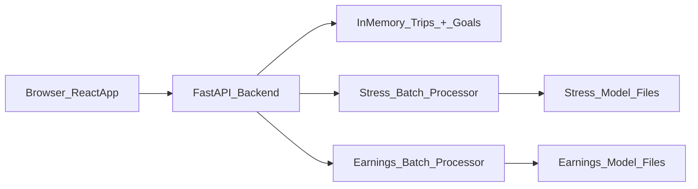

# 🚗 DrivePulse

Real-time driver wellness & earnings intelligence platform for ride-hailing drivers. Uses on-device sensor data (accelerometer, gyroscope, microphone) with ML models to detect stressful driving situations and forecast earnings velocity.

---

## Features

- **Dashboard** — Daily trips, earnings, stress score, timeline
- **Trip Detail** — Map playback, sensor charts, event detection with explainability
- **Trends** — Weekly/monthly earnings, stress, and velocity charts
- **Goals** — Set and track daily earnings targets
- **Manual Predict** — Enter sensor/earnings values → instant ML prediction
- **Batch Upload** — Upload CSV → run inference on multiple trips at once
- **Explainability** — Per-event feature contributions, confidence badges
- **Feedback** — Thumbs up/down on detected events

To log **multiple trips at once**, go to the `Trips` tab and use **Import CSV**.

---

## Architecture

```
Driver-Pulse/
├── backend/                  # FastAPI server
│   ├── main.py               # API endpoints
│   └── data/                 # Sample data, goals, trips import, batch inference
├── frontend/                 # React + Vite + Tailwind
│   └── src/
│       ├── pages/            # Dashboard, Trips, TripDetail, Trends, Goals, Predict, BatchUpload
│       └── components/       # Sidebar, TripMap, SignalCharts, ExplainModal, etc.
├── drivepulse_stress_model/  # Stress ML pipeline
├── earnings/                 # Earnings ML pipeline
└── requirements.txt
```

At a high level, the React frontend talks to a single FastAPI backend (`/api/*`), which serves demo data from an in-memory store and calls local ML helpers for stress and earnings predictions.



---

## Setup

### Prerequisites
- Python 3.9+
- Node.js 18+

### Install & Run

```bash
# Install Python dependencies
pip install -r requirements.txt

# Start backend (http://localhost:8000)
cd backend && python main.py

# In a new terminal — start frontend (http://localhost:5173)
cd frontend && npm install && npm run dev
```

Open **http://localhost:5173** in your browser.

---

## Tech Stack

| Layer | Tech |
|-------|------|
| Frontend | React 18, Vite, Tailwind CSS, Recharts, Leaflet |
| Backend | FastAPI, Uvicorn |
| ML | scikit-learn, NumPy, Pandas |

---

## Data Flow

- **Trips & goals**: Manual entry or CSV import hit `/api/trips` or `/api/trips/import-csv`, which update an in-memory trips list. Goals (`/api/goals`) and dashboard (`/api/dashboard`) recompute current earnings, hours, and forecast from those trips.
- **Batch stress & earnings**: Batch CSV uploads are processed by backend helpers that engineer features, call local models, and return per-row predictions plus summaries as JSON.

---

## Scalability & Modularity

- **Backend**: FastAPI routes in `backend/main.py` delegate to small modules in `backend/data/` for trips, goals, imports, and batch processing, so swapping the in-memory store for a database or separate ML service is a local change.
- **Frontend**: The React app uses a single API client layer (`frontend/src/api/client.js`) plus page/component separation, making it easy to plug in global state, auth, or feature flags without rewriting screens.
- **Batch endpoints**: Batch CSV processing is stateless per request, so multiple backend instances can handle uploads in parallel behind a load balancer.

---

## Testing & Validation Notes

- **Frontend sanity checks** — lightweight helpers in `frontend/src/utils/sanityChecks.js` validate money inputs, time ranges, and clamp goal targets.
- **Example test files** — illustrative, non-wired tests live in `frontend/src/__tests__/` (e.g. `EarningsProgress.test.jsx`, `TripsAddTrip.test.jsx`) to show how key components and behaviours could be validated in a full test setup.
