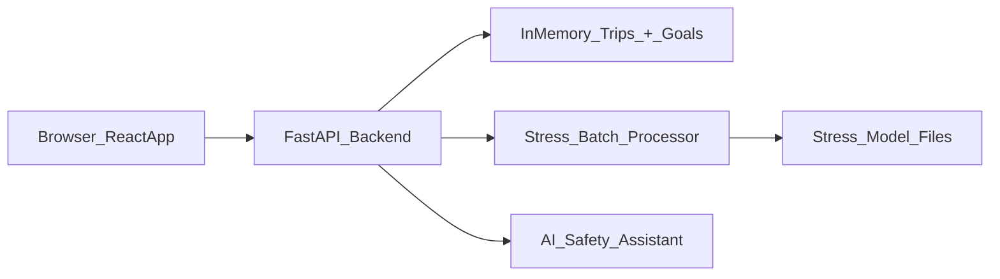

# DriveIntel: Driver Safety & Behavior Analytics

- **Demo Video:** https://youtu.be/PL-XsfVfLA0?feature=shared 
- **Live Application:** https://driveintel-alpha.vercel.app/ 

- **Demo Login Credentials:**  
  Username: demo@driveintel.com  
  Password: demo2026  

- **Note:** This is a prototype platform. Backend features behavior detection and safety analysis.

Real-time driver safety & behavior analytics platform for ride-hailing drivers. Uses on-device sensor data (accelerometer, gyroscope, microphone) with ML models to detect stressful driving situations, analyze driver behaviors, and provide personalized safety insights.

---

## Features

- **Dashboard** — Daily trip overview, safety score, stress event timeline, behavior insights
- **Trip Detail** — **Risk along route**: Leaflet map with severity-colored route segments (from event timestamps), legend, playback cursor, and rich popups (severity, confidence, explain summary); sensor charts and stress event explainability
- **Trends** — Weekly/monthly driver behavior patterns, stress event analytics
- **Safety Goals** — Set and track safety improvements (e.g., reduce high-stress events)
- **Predict** — Enter sensor values → instant stress prediction *(analyst-facing)*; **demo high-risk zones map** (illustrative Leaflet circles over Bangalore — not live incident data)
- **Batch Upload** — Upload CSV → run inference on multiple trips at once *(analyst-facing)*
- **Explainability** — Per-event feature contributions, confidence badges
- **Feedback** — Thumbs up/down on detected events for model improvement
- **Auth** — Login / register with demo accounts or new profile
- **AI Safety Assistant** — DriveIntel Co-pilot for personalized safety tips & guidance

To analyze **multiple trips at once**, go to the `Trips` tab and use **Import CSV**.

---

## Architecture

```
DriveIntel/
├── backend/                       # FastAPI REST API (25 endpoints)
│   ├── main.py                    # Routes, middleware, Pydantic models
│   ├── agent.py                   # AI Safety Assistant integration
│   ├── data/
│   │   ├── sample_data.py         # Synthetic trip/event generator
│   │   ├── batch_processor.py     # Loads stress models, runs batch inference
│   │   ├── trips_import.py        # CSV trip import parser
│   │   ├── users.py               # In-memory auth store
│   │   └── config.py              # Batch limits & constants
│   └── utils/
│       └── logging.py             # Timestamped structured logging
│
├── frontend/                      # React 18 + Vite + Tailwind SPA
│   └── src/
│       ├── pages/                 # 8 pages: Home, Dashboard, Trips, TripDetail,
│       │                          #   Trends, Safety Goals, Predict, BatchUpload
│       ├── components/            # Reusable UI + TripMap (risk-colored route), RiskZonesPreviewMap (demo zones)
│       ├── api/client.js          # Centralised API client
│       └── utils/sanityChecks.js  # Input validation helpers
│
├── driveintel_stress_model/       # Stress Detection ML pipeline
│   ├── run.py                     # CLI entry (--generate --calibrate --train --demo)
│   ├── src/
│   │   ├── generate_data.py       # Synthetic sensor window generator (3,150 samples)
│   │   ├── train.py               # RF classifier training + evaluation
│   │   ├── inference.py           # InferenceEngine with rule-based fallback
│   │   └── hal.py                 # Hardware Abstraction Layer (device calibration)
│   ├── model/                     # Trained artifacts (rf_model.pkl, baselines, contract)
│   └── calibration/               # Device calibration profile
│
├── earnings/earnings/             # [DEPRECATED] Earnings Forecasting ML pipeline
│   ├── README.md                  # See legacy documentation
│   └── ...
│
├── streamlit_app.py               # Standalone Streamlit demo (stress detection focus)
├── tests/data/                    # Example CSVs for batch & import testing
└── requirements.txt               # Root Python dependencies
```



---

## Setup

### Prerequisites
- Python 3.9+
- Node.js 18+
 - Docker Desktop (for judge-friendly containerisation)

### Install & Run (local dev)

```bash
# Install Python dependencies
pip install -r requirements.txt

# Start backend (http://localhost:8000)
cd backend && python main.py

# In a new terminal — start frontend (http://localhost:5173)
cd frontend && npm install && npm run dev
```

Open **http://localhost:5173** in your browser.

---

### Run with Docker

With [Docker Desktop](https://www.docker.com/products/docker-desktop/) running:

```bash
# From the repo root (DriveIntel/)
docker compose up --build
```

Then open:

- Frontend: `http://localhost:5173`
- Backend (direct): `http://localhost:8000/api/health`

The frontend talks to the backend via `/api/*`, which is proxied by Nginx inside the `frontend` container to the `backend` container.

**Demo login (sample account):**

- Username: `demo@driveintel.com`
- Password: `demo2026`

---

## Tech Stack

| Layer | Tech |
|-------|------|
| Frontend | React 18, Vite, Tailwind CSS, Recharts, Leaflet |
| Backend | FastAPI, Uvicorn, Pydantic |
| ML | scikit-learn, NumPy, Pandas |
| Deployment | Vercel (frontend), Render (backend) |

### Hosted split deploy (Vercel + Render)

**Option A — Vercel rewrites (simplest for the whole app):** proxy `/api/*` to your Render service so every relative `fetch('/api/...')` still works. Example `vercel.json` at the repo root or frontend root:

```json
{
  "rewrites": [
    { "source": "/api/:path*", "destination": "https://YOUR-RENDER-SERVICE.onrender.com/api/:path*" }
  ]
}
```

**Option B — `VITE_API_BASE`:** the shared client in [`frontend/src/api/client.js`](frontend/src/api/client.js) uses `import.meta.env.VITE_API_BASE || '/api'`. Set at build time on Vercel to your backend API prefix, e.g. `https://YOUR-RENDER-SERVICE.onrender.com/api`. Note: any **direct** `fetch('/api/...')` in pages (e.g. auth on Home, features on Predict) still needs rewrites unless you point those at the same base.

---

## Data Flow

- **Trips & goals**: Manual entry or CSV import hit `/api/trips` or `/api/trips/import-csv`, which update an in-memory trips list. Goals (`/api/goals`) and dashboard (`/api/dashboard`) recompute current metrics, stress events, and safety scores from those trips.
- **Batch stress inference**: Batch CSV uploads are processed by backend helpers that engineer features, call the local stress model, and return per-row predictions and summaries as JSON.
- **Risk visualization**: Trip detail maps use each event’s `offset_sec` and trip duration to split the polyline into segments: calm stretches vs low/medium/high severity approaching each detected event. Markers reuse backend `location`, `severity`, and `explain.summary` for popups.

---

## Scalability & Modularity

- **Backend**: FastAPI routes in `backend/main.py` delegate to small modules in `backend/data/` for trips, goals, imports, and batch processing, so swapping the in-memory store for a database or separate ML service is a local change.
- **Frontend**: The React app uses a single API client layer (`frontend/src/api/client.js`) plus page/component separation, making it easy to plug in global state, auth, or feature flags without rewriting screens.
- **Batch endpoints**: Batch CSV processing is stateless per request, so multiple backend instances can handle uploads in parallel behind a load balancer.
- **AI Safety Assistant**: Integrates Google's Gemini API for intelligent, personalized driver guidance within the safety framework.

---

## Testing & Validation Notes

- **Frontend sanity checks** — lightweight helpers in `frontend/src/utils/sanityChecks.js` validate time ranges and inputs.
- **Example test files** — illustrative tests live in `frontend/src/__tests__/` (e.g., `TripsAddTrip.test.jsx`) to show how key components and behaviors could be validated in a full test setup.

---

## Future Roadmap (Prototype Phase)

### Coming Soon:
- 🚨 **Production high-risk routing** — The **Predict** page includes a **demo** map (illustrative zones only). A future release would connect real historical accident or incident datasets and live routing warnings.
- 📊 **Real-time Driver Coaching** — In-trip feedback on driving behavior with immediate tips for improvement.
- 🔔 **Smart Alerts** — Predictive notifications about risky traffic conditions ahead.
- 🌍 **Multi-city Expansion** — Support for more cities beyond Mumbai, with localized behavior analytics.

---

## Contributing

This is a prototype platform built for the Uber Hackathon. Contributions are welcome. Please fork, create a feature branch, and submit a pull request.

---

## License

MIT License. See LICENSE file for details.

---

## Support

For issues or questions, please file an issue on GitHub or contact the development team.
