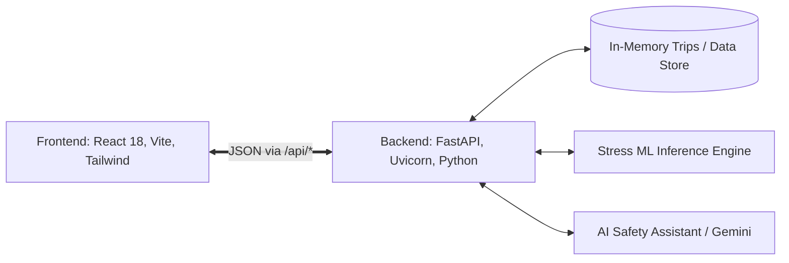

# DriverIntel: Advanced Driver Safety & Behavior Analytics

<div align="center">
  <p><strong>A state-of-the-art Web Application designed to improve driver safety, behavior, and efficiency in the ride-hailing industry through Artificial Intelligence.</strong></p>
</div>

---

## 🚀 Welcome to DriverIntel

**DriverIntel** is a real-time driver safety & behavior analytics platform built exclusively for ride-hailing drivers. By leveraging on-device sensor data (accelerometer, gyroscope, and microphone) via Machine Learning (ML) models, it detects stressful driving situations, analyzes dangerous behavior patterns, and provides highly personalized safety coaching—all wrapped in a stunning, premium dark-themed glassmorphic user interface.

- **Live Application:** [DriverIntel Alpha Vercel](https://driveintel-alpha.vercel.app/)
- **Demo Video:** [YouTube Demo](https://youtu.be/PL-XsfVfLA0?feature=shared)

**Demo Credentials:**
> **Username:** `demo@driveintel.com`
> **Password:** `demo2026`

---

## ✨ Core Features

DriverIntel provides a complete suite of powerful tools designed for both individual drivers and ride-hailing platform analysts:

*   **📊 Dynamic Dashboard** — Get a comprehensive daily trip overview, your overall safety score, a stress event timeline, and high-level behavior insights at a glance.
*   **🗺️ Interactive Trip Mapping** — **Risk along route:** Leaflet maps with dynamically severity-colored route segments based on live event timestamps. Includes playback cursors and rich popups explaining the severity, model confidence, and safety logic.
*   **📈 Advanced Trends** — Understand your driving behavior over time with weekly/monthly patterns, fatigue tracking, and stress event analytics.
*   **🎯 Goal Tracking** — Improve your daily safety by setting, committing to, and tracking behavioral modifications (e.g., reduce harsh braking, defensive driving).
*   **🔮 Predict & Preview** — Enter raw sensor telemetry for instant stress prediction. Also features a preview Map with high-risk geographical zones.
*   **📁 Batch Processing** — Built for analysts. Upload a CSV of multi-driver telemetry and run large-scale inference simultaneously for macro-level safety analysis.
*   **🤖 AI Co-Pilot Assistant** — An integrated, context-aware AI Safety Assistant (powered by Google Gemini) ready to provide interactive, personalized coaching and guidance on demand.
*   **🔍 Explainable AI (XAI)** — Understand *why* an event was flagged. DriverIntel provides per-event feature contributions (e.g., high lateral acceleration) and model confidence percentages.

---

## 🎨 Premium UI/UX

DriverIntel utilizes a custom **High-Contrast Dark Glassmorphism** design language.
The entire application was built iteratively to reflect an ultra-modern aesthetic standard using Tailwind CSS:

*   **Vibrant Gradients over Deep Backgrounds** (`slate-950` / `slate-900`)
*   **Translucent Frosted Glass** layered panels (`backdrop-blur-xl`, `bg-white/5` borders)
*   **Sleek Micro-animations**, customized chart tooltips, and dynamic states
*   Zero legacy light-mode elements—providing drivers with maximum visibility, luxury, and eye comfort even during late-night shifts.

---

## 🏗️ Architecture

DriverIntel uses a robust split architecture designed for performance and scale.



### Folder Structure
```text
DriverIntel/
├── backend/                       # FastAPI REST API
│   ├── main.py                    # Core routing and controllers
│   ├── agent.py                   # LLM Integration (AI Safety Assistant)
│   └── data/                      # Batch Processing, Import handling, config
├── frontend/                      # React 18 + Vite + Tailwind SPA
│   └── src/
│       ├── pages/                 # Full Page Views (Dashboard, Predict, etc.)
│       ├── components/            # Reusable UI (Leaflet Maps, Charts, Copilot)
│       ├── api/                   # Centralized application client
├── driveintel_stress_model/       # ML Pipeline for Stress Detection
│   ├── src/                       # Random Forest training, XAI logic
│   └── model/                     # Artifacts (.pkl)
└── streamlit_app.py               # Standalone Streamlit rapid diagnostic tool
```

---

## 💻 Tech Stack

| Layer | Technologies |
|-------|------|
| **Frontend** | React 18, Vite, Tailwind CSS, Recharts, Leaflet, Lucide Icons |
| **Backend** | Python 3.9+, FastAPI, Uvicorn, Pydantic |
| **AI / ML** | Scikit-Learn, Pandas, NumPy, Google Gemini API |
| **Deploy Target**| Vercel (Frontend Component) & Render (Backend Service) |

---

## 🛠️ Setup & Local Development

### Prerequisites
- Python 3.9+
- Node.js 18+

### 1. Install & Run Directly

Start the backend:
```bash
cd backend
pip install -r ../requirements.txt
python main.py
```
*(Runs on `http://localhost:8000`)*

Start the frontend:
```bash
cd frontend
npm install
npm run dev
```
*(Runs on `http://localhost:5173`)*

Open **http://localhost:5173** to use the application.

### 2. Run via Docker Compose

```bash
# Navigate to repository root
docker compose up --build
```
Then visit `http://localhost:5173`! All API calls are locally proxied by NGINX inside the container.

---

## 🔮 Roadmap (Next Steps)

*   [ ] **Predictive High-Risk Routing** — Seamless integration of the *Predict* UI with production historical accident dataset grids for live hazard routing.
*   [ ] **In-Trip Voice Coaching** — Expand the AI Assistant into an active voice companion that speaks safely contextualized warnings.
*   [ ] **Telematics Database Integration** — Migrate the in-memory data store to a production-ready PostgreSQL instance with PostGIS for geo-queries.

---

## 🤝 Contributing

This prototype was built with a vision for safer streets. We highly encourage contributions!
Feel free to fork the repository, cut a feature branch, and submit a PR for review.

## 📄 License
This project operates under the **MIT License**. Refer to `LICENSE` for exact specifications.

<div align="center">
  <sub>Built for the future of Ride-Hailing.</sub>
</div>
