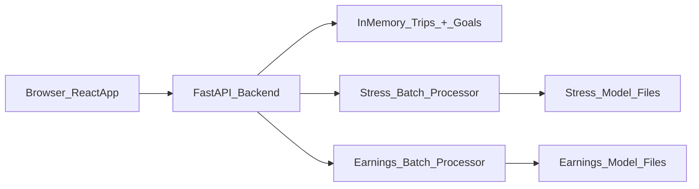

# Driver Pulse: Team ACE

- **Demo Video:** https://youtu.be/PL-XsfVfLA0?feature=shared 
- **Live Application:** https://driver-pulse-gamma.vercel.app/ 

- **Judge Login Credentials:**  
  Username: judge@uber.com  
  Password: hackathon2026  

- **Note to Judges:** The backend is hosted on Render and may take around 60 seconds to wake up on the first request.

Real-time driver wellness & earnings intelligence platform for ride-hailing drivers. Uses on-device sensor data (accelerometer, gyroscope, microphone) with ML models to detect stressful driving situations and forecast earnings velocity.

---

## Features

- **Dashboard** — Daily trips, earnings, stress score, timeline
- **Trip Detail** — Map playback, sensor charts, event detection with explainability
- **Trends** — Weekly/monthly earnings, stress, and velocity charts
- **Goals** — Set and track daily earnings targets
- **Predict** — Enter sensor/earnings values → instant ML prediction *(judge-facing)*
- **Batch Upload** — Upload CSV → run inference on multiple trips at once *(judge-facing)*
- **Explainability** — Per-event feature contributions, confidence badges
- **Feedback** — Thumbs up/down on detected events
- **Auth** — Login / register with demo accounts or new profile

To log **multiple trips at once**, go to the `Trips` tab and use **Import CSV**.

---

## Architecture

```
Driver-Pulse/
├── backend/                       # FastAPI REST API (25 endpoints)
│   ├── main.py                    # Routes, middleware, Pydantic models
│   ├── data/
│   │   ├── sample_data.py         # Synthetic trip/route/event generator
│   │   ├── batch_processor.py     # Loads ML models, runs batch inference
│   │   ├── trips_import.py        # CSV trip import parser
│   │   ├── users.py               # In-memory auth store
│   │   └── config.py              # Batch limits & constants
│   └── utils/
│       └── logging.py             # Timestamped structured logging
│
├── frontend/                      # React 18 + Vite + Tailwind SPA
│   └── src/
│       ├── pages/                 # 8 pages: Home, Dashboard, Trips, TripDetail,
│       │                          #   Trends, Goals, Predict, BatchUpload
│       ├── components/            # 16 reusable components
│       ├── api/client.js          # Centralised API client
│       └── utils/sanityChecks.js  # Input validation helpers
│
├── drivepulse_stress_model/       # Stress Detection ML pipeline
│   ├── run.py                     # CLI entry (--generate --calibrate --train --demo)
│   ├── src/
│   │   ├── generate_data.py       # Synthetic sensor window generator (3,150 samples)
│   │   ├── train.py               # RF classifier training + evaluation
│   │   ├── inference.py           # InferenceEngine with rule-based fallback
│   │   └── hal.py                 # Hardware Abstraction Layer (device calibration)
│   ├── model/                     # Trained artifacts (rf_model.pkl, baselines, contract)
│   └── calibration/               # Device calibration profile
│
├── earnings/earnings/             # Earnings Forecasting ML pipeline
│   ├── run.py                     # Sequential pipeline entry
│   ├── src/
│   │   ├── build_dataset.py       # Merges drivers + goals + velocity + trips
│   │   ├── features.py            # 14-feature engineering (lags, rolling avg, rush flags)
│   │   ├── augment.py             # 5× Gaussian noise augmentation
│   │   ├── train.py               # RF regressor training + evaluation
│   │   └── inference.py           # Batch velocity prediction
│   ├── model/                     # Trained artifacts (rf_model.pkl, contract)
│   └── data/                      # Source CSVs (drivers, goals, velocity, trips)
│
├── streamlit_app.py               # Standalone Streamlit demo (3 tabs)
├── tests/data/                    # Example CSVs for batch & import testing
└── requirements.txt               # Root Python dependencies
```



---

## Setup

### Prerequisites
- Python 3.9+
- Node.js 18+
 - Docker Desktop (for judge-friendly containerisation)

### Install & Run (local dev)

```bash
# Install Python dependencies
pip install -r requirements.txt

# Start backend (http://localhost:8000)
cd backend && python main.py

# In a new terminal — start frontend (http://localhost:5173)
cd frontend && npm install && npm run dev
```

Open **http://localhost:5173** in your browser.

---

### Run with Docker

With [Docker Desktop](https://www.docker.com/products/docker-desktop/) running:

```bash
# From the repo root (Driver-Pulse/)
docker compose up --build
```

Then open:

- Frontend: `http://localhost:5173`
- Backend (direct): `http://localhost:8000/api/health`

The frontend talks to the backend via `/api/*`, which is proxied by Nginx inside the `frontend` container to the `backend` container.

**Judge login (demo account):**

- Username: `judge@uber.com`
- Password: `hackathon2026`

---

## Tech Stack

| Layer | Tech |
|-------|------|
| Frontend | React 18, Vite, Tailwind CSS, Recharts, Leaflet |
| Backend | FastAPI, Uvicorn |
| ML | scikit-learn, NumPy, Pandas |

---

## Data Flow

- **Trips & goals**: Manual entry or CSV import hit `/api/trips` or `/api/trips/import-csv`, which update an in-memory trips list. Goals (`/api/goals`) and dashboard (`/api/dashboard`) recompute current earnings, hours, and forecast from those trips.
- **Batch stress & earnings**: Batch CSV uploads are processed by backend helpers that engineer features, call local models, and return per-row predictions plus summaries as JSON.

---

## Scalability & Modularity

- **Backend**: FastAPI routes in `backend/main.py` delegate to small modules in `backend/data/` for trips, goals, imports, and batch processing, so swapping the in-memory store for a database or separate ML service is a local change.
- **Frontend**: The React app uses a single API client layer (`frontend/src/api/client.js`) plus page/component separation, making it easy to plug in global state, auth, or feature flags without rewriting screens.
- **Batch endpoints**: Batch CSV processing is stateless per request, so multiple backend instances can handle uploads in parallel behind a load balancer.

---

## Testing & Validation Notes

- **Frontend sanity checks** — lightweight helpers in `frontend/src/utils/sanityChecks.js` validate money inputs, time ranges, and clamp goal targets.
- **Example test files** — illustrative, non-wired tests live in `frontend/src/__tests__/` (e.g. `EarningsProgress.test.jsx`, `TripsAddTrip.test.jsx`) to show how key components and behaviours could be validated in a full test setup.
